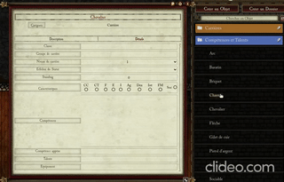
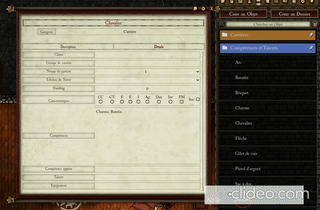
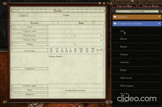
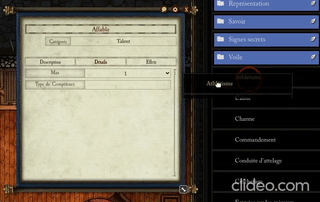

# WFRP 4 Enhanced Drag and Drop Items
This module allow simple drop function for items.

## Drop skill to career sheet

## Drop talent or trait to career sheet

## Drop trappig or ammunition or armour or container or money or weapon to career sheet

## Drop skill to talent sheet

## Module link
https://raw.githubusercontent.com/mcailleaux/WFRP4-FoundryVTT-enhanced-drag-n-drop-items/dist/module.json

## Module Beta link
https://raw.githubusercontent.com/mcailleaux/WFRP4-FoundryVTT-enhanced-drag-n-drop-items/dist-beta/module-beta.json
